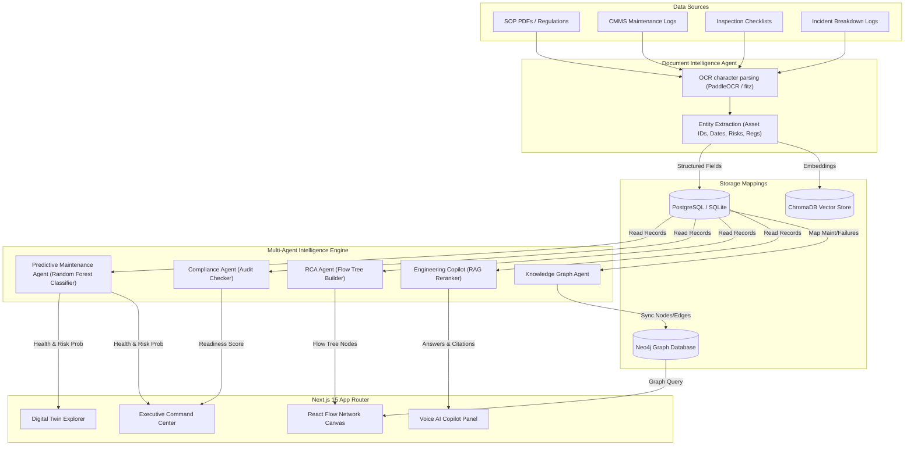

# Industrial Brain AI - Architecture Diagram

Here is the system data flow and multi-agent interaction schematic for the **Industrial Brain AI** platform.

---

## Data Pipeline Details

1. **Document Ingestion**: Files uploaded via the **Document Manager** are routed to the **Document Intelligence Agent**. This agent runs PyMuPDF character parses or OCR to extract text content and utilizes regex rules to pull Asset tags (e.g., `P-101`), inspector names, risk parameters, and dates.
2. **Database Syncer**: Extracted data is saved as structured logs in the relational database (PostgreSQL/SQLite). The **Knowledge Graph Agent** is immediately triggered via a database transaction hook to sync these tables into the Neo4j graph nodes and relationships (e.g., `Asset -SUFFERED_FAILURE-> FailureEvent`).
3. **Reasoning Loop**:
   - The **Predictive Maintenance Agent** pulls log parameters, fits a Random Forest classifier, and calculates health indexes.
   - The **Compliance Agent** runs periodic checks against inspection dates to alert on overdue certifications.
   - The **RCA Agent** isolates breakdown reports and structures failure trees.
4. **WebSocket Broadcast**: Any new document uploads, critical risks, or database reseeds trigger a WebSocket broadcast message from the FastAPI manager to the Next.js header stream, instantly sliding in warning alert banners.
